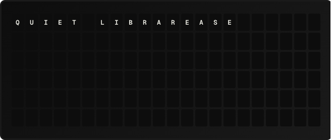

# Quiet Library Plugin

Updates the board word by word in small batches with long pauses between sends, for the quietest possible refresh.

**→ [Setup Guide](./docs/SETUP.md)**

## Overview

Quiet Library is a **transition plugin** (beta): instead of providing data for templates, it controls *how* the board animates from one message to the next. It diffs the current and target grids, groups the changed tiles into word blocks, and flips at most a handful of tiles per step with a long pause between steps — so only a few split-flap modules are ever spinning at once. The effect is modeled on the split-flap board in the Qantas First Class lounge at Sydney airport, which updates one word at a time to keep the room quiet.

Concept and algorithm by [@wonkybutt](https://github.com/wonkybutt) ([PR #711](https://github.com/Fiestaboard/FiestaBoard/pull/711)), reimplemented on the transition-plugin SDK.

## Template Variables

None. Transition plugins do not expose template variables; they are selected as a page or system transition strategy (`plugin:quiet_library`).

## Example Templates

Not applicable — enable the **Transition Plugins** beta in Settings → Beta, then pick *Quiet Library* as a page's transition (or preview it on the Transition Lab page).

## Configuration

| Setting | Type | Default | Description |
|---------|------|---------|-------------|
| `batch_size` | integer (1–15) | `6` | Tiles flipped per step. Smaller is quieter. A step never spans two words. |
| `step_delay_ms` | integer (1000–60000) | `14500` | Pause between steps. The default clears the board hardware's ~14s flap debounce window so every step animates. |

Runtime caps (from `transition_settings`): interruptible, ≤512 frames, ≤30 minutes. A new page or manual send cancels an in-progress transition cleanly.

## Features

- Word-boundary-aware diffing: only changed tiles flip, grouped by word
- Micro-batching (default ≤6 tiles per step) to soften the flap sound
- Long inter-step delay tuned to the hardware's flap debounce timer
- Trailing/leading blank cleanup rides along with the adjacent word
- Works on Flagship, Note, and W×H note-array boards

## Author

wonkybutt (Quiet Library concept, PR #711) — SDK port by the FiestaBoard team
